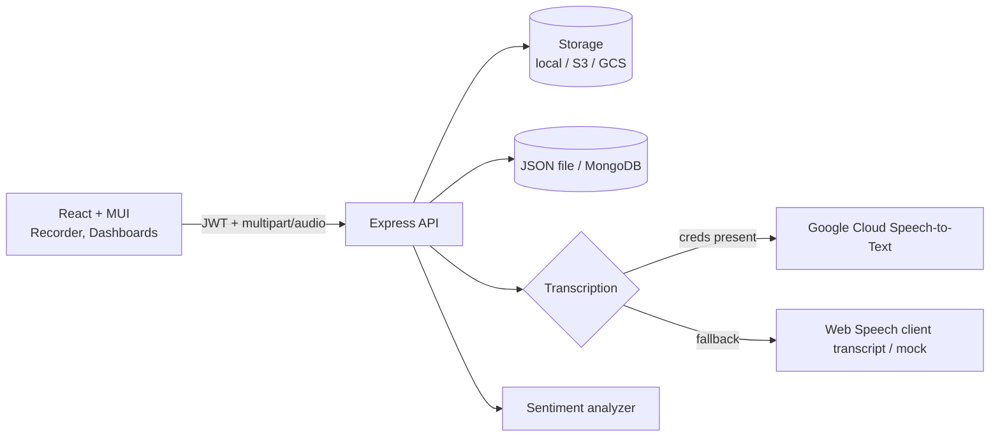

# Architecture — Voice Feedback Portal

## Diagram (text)

```
┌──────────────┐   HTTPS/JSON + multipart    ┌──────────────────┐
│  React (Vite │ ──────────────────────────▶ │  Express API     │
│  + MUI)      │ ◀────────────────────────── │  :5000           │
│  - Recorder  │   JWT, /api/auth,           │  - auth routes   │
│    MediaRec. │   /api/feedback, /api/stats │  - multer upload │
│  - WebSpeech │                             │  - transcribe →  │
│  - Dashboards│                             │    sentiment     │
└──────────────┘                             └────┬──────┬──────┘
                                                  │      │
                                     ┌────────────┘      └────────────┐
                                     ▼                                ▼
                              ┌─────────────┐                  ┌─────────────┐
                              │ Storage     │                  │ Data        │
                              │ local disk  │                  │ file JSON   │
                              │ uploads/    │                  │ (default)   │
                              │ or S3 / GCS │                  │ or MongoDB  │
                              └─────────────┘                  └─────────────┘
                                                  │
                                                  ▼
                                         ┌─────────────────┐
                                         │ External STT    │
                                         │ Google Cloud STT│
                                         │ (if creds) else │
                                         │ WebSpeech/mock  │
                                         └─────────────────┘
```

Mermaid version (paste into mermaid.live):



## Design decisions

| Concern | Decision | Why |
|---|---|---|
| UX | Big red Press-to-Record, live interim transcript, timer, pre-upload playback | Users trust what they recorded; reduces re-takes |
| Latency | Upload returns 201 immediately; transcription+sentiment run async, UI polls/refreshes | Recording upload (large) never blocks on slow STT |
| STT integration | Strategy adapter (`services/stt/`: google → web-speech → mock, facaded by `services/transcription.js`) | Works offline/zero-creds for demo, upgrades to GCP/Whisper by adding a provider file |
| Sentiment | Rule-based multilingual lexicon (`services/sentiment/lexicons.js` + `analyzer.js`), same `{label,score,confidence}` shape as GCP NL | No billing/API key needed; drop-in upgrade later |
| Storage | Local disk now, `STORAGE_MODE` + `audioUrl` abstraction for S3/GCS | Cheapest for assignment, scales by swapping one layer |
| DB | File JSON default, Mongoose schemas ready, `MONGO_URI` switches | Zero-config grading + production path (schemas documented) |
| Scalability | Stateless JWT, `/audio/:filename` stream endpoint (CDN-able), 200-item list cap + filters | Horizontal backend scaling; CDN can cache audio |
| Security | bcrypt, short JWT, role middleware, register forces `user`, owner-or-admin reads | Prevents privilege escalation, limits data exposure |

## Backend schema (MongoDB)

`users`: name, email(unique), passwordHash, role(user|admin), timestamps.
`feedbacks`: userId(ref), orderId, audioUrl, fileName, mimeType, sizeBytes, durationSec,
language, clientTranscript, transcript{text,confidence,engine,language},
sentiment{label,score,confidence,keywords}, status(uploaded|transcribed|failed),
adminNotes, timestamps. See `backend/src/models.js`.
